# lnxCAD (Ctrl-Alt-Del) Rescue GUI

**CAD Rescue GUI** is a standalone system rescue utility for Linux (written in C99, using `libdrm`, with no major external dependencies). It invokes a graphical emergency interface (similar to the Windows Ctrl+Alt+Del screen) in a foolproof manner, even in the event of a total freeze of the desktop environment (X11/Wayland) or extreme saturation of hardware resources.

## Concrete Use Case

### Scenario: The Unresponsive Desktop
1. **The Freeze**: You are working on your desktop, and a heavy compiler run or a buggy web browser tab completely saturates your CPU and RAM. The mouse pointer moves, but clicking anything does nothing. Keyboard shortcuts like `Ctrl+Alt+F3` (VT Switch) or running commands via SSH are unresponsive or time out.
2. **The Recovery**: You press `Ctrl+Alt+Del`.
3. **The Intervention**: 
   - Within milliseconds, **lnxCAD** steals the virtual terminal, forces the monitor to wake up, grabs raw input events, and displays the rescue GUI directly from memory.
   - You navigate to the **Task Manager** tab, sort processes by CPU or RAM usage, select the offending process (e.g., `chrome` or `gcc`), and click **Kill** (`SIGKILL`).
4. **The Safe Return**: You click **Close** in the bottom-right corner. The screen restores your previous desktop compositor VT state, and your session resumes immediately with all other open windows intact.

## Who is this for?

**lnxCAD** is designed for anyone managing or using Linux machines under conditions where downtime or hard restarts must be avoided:
- **System Administrators & DevOps**: Managing mission-critical servers, remote workstations, or kiosk systems where a service freeze shouldn't require a physical power cycle.
- **Desktop Users**: Those who want a highly reliable "Ctrl+Alt+Del" manager (similar to Windows) that can rescue a frozen desktop environment (GNOME, KDE, TDE) without losing active work.
- **High-Performance Computing (HPC) & Build Clusters**: Systems under extreme CPU/RAM saturation where standard SSH or terminal commands freeze due to swap-thrashing or OOM conditions.
- **Headless GPU Servers**: AI/ML training and GPU-heavy rendering machines where the graphical stack may crash or lock up DRM mastership, requiring lower-level intervention.

## Why not Magic SysRq / REISUB / systemd?

While Linux provides built-in low-level kernel recovery tools, **lnxCAD** bridges a critical gap:
- **Magic SysRq / REISUB**: Magic SysRq is a blunt instrument. It is either completely disabled for security reasons, or it only allows raw actions like killing *all* tasks (`SysRq+k`) or brutally rebooting (`SysRq+b`). **lnxCAD** lets you inspect and selectively target only the offending process, preserving the rest of your session.
- **systemd / logind / coredump**: When systemd or logind itself freezes, becomes unresponsive, or is blocked by D-State I/O loops, standard service management commands fail. **lnxCAD** operates outside systemd session contexts, relying on raw direct kernel interfaces.
- **GPU / Compositor Crash**: When the X11/Wayland display server crashes or enters a zombie state (holding DRM mastership), keyboard events are swallowed or the screen goes black. **lnxCAD** violently steals the VT and takes over the DRM frame buffer directly.
- **Interactive Rescue**: Instead of a blind command, it provides a full, interactive ANSI terminal and process manager (completely pinned in RAM via `memfd` and `mlockall`), ensuring you can debug and repair the system on the spot.

## Resilience & Survival Architecture (Phases 1 & 2)

To ensure this interface always displays and responds, regardless of how degraded the host system is, multiple low-level "safety nets" have been implemented in the code to bypass the traditional OS software hierarchy.

### Phase 1: Immediate Display and Input Resuscitation
- **Exclusive Virtual Terminal Steal (VT Steal)**: Executes `VT_ACTIVATE` / `VT_WAITACTIVE` to force the kernel to switch to a clean, empty VT, thereby ejecting the crashed window manager.
- **Forced Monitor Wake-up (Unblank)**: Calls `ioctl(TIOCLINUX, 4)` to forcefully awaken the graphics card from DPMS mode (display sleep), bypassing the potentially frozen power management stack.
- **Aggressive DRM Master Takeover**: Uses `ioctl(DRM_IOCTL_SET_MASTER)` to brutally strip video access from the previous compositor and take exclusive control of the Framebuffer.
- **Kernel Log Muting (klogctl)**: Uses `klogctl(6)` to disable `printk` messages on the virtual terminal. This prevents kernel panic messages from visually corrupting the GUI display.
- **Hardware Input Locking (EVIOCGRAB)**: The keyboard is opened via a raw `evdev` node and strictly locked. This prevents a "zombie" X11 server from intercepting keystrokes in the background. The mouse is handled via a fail-safe `mousedev` node that supports on-the-fly hot-plugging.
- **Input Event Flushing**: Immediately flushes the keyboard event queue (`while(read...)`) after the grab to ensure that any key pressed before the crash (e.g., ALT/CTRL) does not remain stuck and disrupt GUI navigation.
- **Safe Exit & Restoration**: Upon exit, `restore_vt()` (hooked to `atexit` and fatal signals like `SIGSEGV`) carefully restores the text terminal (`KD_TEXT`) and the keyboard (`K_UNICODE`) to ensure the user isn't left with a dead console ("black screen").

### Phase 2: System Resource Stabilization
- **Anti-OOM Immunity (Out-Of-Memory Killer)**: The binary automatically assigns itself the maximum exclusion score by writing `-1000` to `/proc/self/oom_score_adj`. It becomes strictly "untouchable" by the kernel during RAM starvation storms.
- **Swap-Thrashing Prevention (mlockall)**: Calls `mlockall(MCL_CURRENT | MCL_FUTURE)` to "pin" the software into physical RAM. The GUI will **never** be swapped out to disk, guaranteeing perfect fluidity even during massive Swap congestion.
- **Maximum Best-Effort I/O Priority (ioprio_set)**: Places the process in the `IOPRIO_CLASS_BE` I/O class (priority 0). This ensures priority access when reading `/proc` or executing scripts, without the risk of starving vital kernel threads (unlike the `RT` class).
- **Real-Time CPU Priority (SCHED_FIFO)**: Applies `sched_setscheduler` with priority 99 (Real-Time) so the rendering loop is executed ahead of the entire userspace.

### Phase 3: Advanced Industrial Edge Cases Mitigations
- **Hardware Backlight Recovery**: On laptops, a "black screen" is often just a zeroed-out backlight caused by ACPI or compositor crashes. The GUI scans all `/sys/class/backlight/*` interfaces and forces a safe ~33% brightness if the screen is virtually black (<= 5%). It seamlessly restores the original values upon exit to prevent a jarring UX.
- **Heap Corruption & Blocking Malloc Evasion**: In severe Out-Of-Memory situations, calling `malloc()` can freeze the program due to `glibc` arena locks. To survive this, the massive 4MB UI texture buffer is statically allocated in the `.bss` section, guaranteeing zero dynamic memory allocation at runtime.
- **Input Flood Protection**: A crashing touchpad or mouse driver can spam thousands of IRQs per second, locking the CPU at 100% in an infinite event-reading loop. The `evdev` read loops are strictly capped per frame (e.g., 64 events max) to guarantee constant rendering and responsiveness regardless of hardware spam.
- **ANSI Terminal Purge**: When restoring the original TTY, a brute-force ANSI escape sequence (`\033c` - Reset to Initial State) is written to the terminal descriptor. This cures "Zombie VT" states where the previous crashed shell left invisible text, alternate buffers, or broken color palettes.
- **SIGPIPE Immunity**: Added `signal(SIGPIPE, SIG_IGN)` to prevent the entire rescue GUI from collapsing silently if a local socket or pipe unexpectedly breaks.

### Phase 4: Low-Level Architecture & "Zero-Trust" Defenses
- **Syscall-Only & Zero-Libc Critical Paths**: To survive severe heap corruption and glibc lockups, all critical recovery logic and string manipulations rely strictly on custom `safe_*` functions and direct kernel syscalls (`SYS_ioctl`, `SYS_getdents64`, `SYS_setpriority`). Standard library functions that might allocate or block internally are strictly banned from the recovery path.
- **Alternate Signal Stack (sigaltstack)**: If the primary thread suffers a catastrophic `Stack Overflow` (e.g., recursive exhaustion), standard `SIGSEGV` handlers cannot run due to lack of stack space. A statically allocated `64KB` alternate stack ensures the `emergency_restore` handler *always* executes to return control of the display to the user.
- **Cgroups Root Evasion**: If the host Desktop Environment (e.g., Gnome/KDE) crashes while its `cgroup` is being throttled or frozen, child processes inherit those limits. The GUI surgically escapes by writing its PID to the root `/sys/fs/cgroup/cgroup.procs`, breaking free from any memory or CPU "freezer" isolation.
- **Strict Atomic Recovery**: The cleanup routine `restore_vt()` utilizes GCC's hardware memory barrier `__atomic_test_and_set(..., __ATOMIC_SEQ_CST)` to guarantee that the DRM un-mapping and TTY restoration run exactly once, avoiding race conditions if a `SIGTERM` arrives at the exact millisecond the user triggers an `atexit` closure.
- **Strategic Memlock Positioning**: While `mlockall(MCL_CURRENT | MCL_FUTURE)` prevents swapping, doing it too early binds the process to strict `RLIMIT_MEMLOCK` user limits, causing subsequent DRM `mmap`s to fail. It is thus carefully deferred until *after* all massive video buffers are mapped.
- **Dynamic Device Scanning via getdents64**: Hardcoded limits (like checking only `/dev/input/event0` to `31`) are bypassed using raw directory block parsing (`getdents64`), ensuring keyboards are found instantaneously even on heavily virtualized server architectures with hundreds of event nodes.

### Phase 5: Integrated Task Manager (Zero-Allocation)
- **Full Process Inspector**: A built-in task manager provides real-time system visibility without requiring any external tool. It displays the Top 15 processes sorted by either **RAM consumption** or **CPU usage** (with tabbed navigation), plus a **Search mode** to locate processes by name.
- **Zero Dynamic Allocation**: The entire task manager operates on statically allocated arrays (`MAX_TOP_PROCS = 15`, `HIST_SIZE = 16384`). All `/proc` scanning, sorting, and CPU delta calculations are performed without a single `malloc()`, surviving even the most extreme OOM conditions.
- **Raw Syscall Process Scanning**: Process enumeration uses `SYS_getdents64` to list `/proc` entries and direct `open()/read()` on `/proc/<pid>/stat` and `/proc/<pid>/statm` for each process. No `opendir()`/`readdir()` dependency on a potentially corrupted glibc.
- **CPU Usage Delta Tracking**: CPU percentages are computed via a double-buffer ring (`cpu_hist_A`/`cpu_hist_B`) that records cumulative `utime+stime` ticks per PID across successive scans. The delta is converted to a percentage using wall-clock elapsed time, providing accurate readings even under heavy system load.
- **Process Control Actions**: Each listed process can be individually acted upon via dedicated buttons: **Pause** (`SIGSTOP`), **Terminate** (`SIGTERM`, graceful), or **Kill** (`SIGKILL`, immediate). A safety blacklist prevents accidental killing of critical system services (`systemd`, `dbus`, `Xorg`, `pipewire`, etc.).
- **System Health Overview**: Displays global RAM and Swap usage (total/used in MB) parsed directly from `/proc/meminfo`, providing instant system health awareness.
- **Full Keyboard Navigation**: The task manager supports complete keyboard operation (Tab to cycle focus groups, arrows to navigate tabs/rows/columns, Enter/Space to trigger actions), essential when a mouse driver has crashed.

### Phase 6: Integrated Terminal Emulator
- **libtsm VTE Engine**: A full VT100/ANSI terminal emulator is integrated via `libtsm` (statically linked), providing escape sequence parsing, color palettes (`solarized-black`), alternate screen buffer, and cursor management — enough to run `htop`, `mc`, `nano`, and other interactive TUI applications.
- **PTY Bridge (shl-pty)**: The terminal communicates with a real shell process (`/bin/bash` with `/bin/sh` fallback) via a POSIX pseudo-terminal (`posix_openpt`), providing full bidirectional I/O with proper job control and `SIGWINCH` resizing.
- **Embedded BusyBox Emergency Shell**: A custom musl-static BusyBox binary is embedded directly into the `.rodata` section (~332KB). At startup, it is loaded into a seal-backed anonymous file descriptor (`memfd_create`) before `mlockall` is called, ensuring it is permanently pinned in RAM.
- **Zero-I/O Execution via execveat**: Commuting to BusyBox launches the shell from the RAM file descriptor using `fexecve` (via `/proc/self/fd/N`) with an automated direct syscall fallback using `execveat(fd, "", ..., AT_EMPTY_PATH)`. This ensures shell availability even if `/proc` is unmounted or the disk is completely dead.
- **Commutation and Mode Selection**: A dedicated Nuklear header bar above the terminal allows switching between the standard system `bash` and the embedded RAM-backed `busybox` shell.
- **Fail-Safe Greyed-out Behavior**: If `memfd_create` is unsupported by the host kernel (pre-3.17), the GUI automatically greys out the `busybox` mode selector button and blocks interaction, falling back to system `bash` / `sh`.
- **Zombie-Safe Lifecycle**: The shell child process is properly reaped via `waitpid(WNOHANG)` on PTY close, and `SA_NOCLDWAIT` is installed on `SIGCHLD` as a belt-and-suspenders defense against zombie accumulation. Typing `exit` or pressing `Escape` cleanly tears down the PTY and releases all resources.
- **Auto-Respawn**: When the terminal is reopened after a previous shell has exited, a fresh shell is automatically spawned with a clean `tsm_screen_reset()` and `tsm_vte_reset()`, providing a seamless user experience.
- **Dedicated Monospace Font**: The terminal uses Nuklear's built-in `ProggyClean` monospace font (13px) via a separate `font_mono` handle, ensuring pixel-perfect grid alignment. The rest of the GUI retains the custom proportional font for aesthetic quality.
- **Comprehensive Keyboard Mapping**: Full alphanumeric input (A-Z, 0-9), all special characters (`!@#$%^&*()` etc.), function keys (F1-F10), numpad keys (KP0-KP9, `+`, `-`, `*`, `/`, `.`, KPEnter), and modifier combinations (Shift, Ctrl+C) are mapped from raw Linux `evdev` scancodes to XKB keysyms for injection into the VTE.
- **Dynamic Grid Resizing**: The terminal grid (columns × rows) is recalculated every frame from the window bounds and cell dimensions, with automatic `tsm_screen_resize()` and `shl_pty_resize()` to keep the shell in sync with the display.
- **Pixel-Perfect Rendering**: Cell coordinates are cast to integers (`(float)(int)(...)`) before rendering to prevent subpixel blur and anti-aliasing artifacts that would make text unreadable on the software rasterizer.

### Phase 7: Universal & Deterministic Session Locking
- **Raw Environment Sniffing**: To seamlessly trigger screen lockers (`dcop`, `qdbus`, `swaylock`) without knowing the Desktop Environment in advance, the GUI scans `/proc` to find a graphical process strictly owned by the user (`st.st_uid == user_session.uid`). It completely duplicates the process's raw `/environ` block, capturing critical variables (like `DCOPSERVER` or `DBUS_SESSION_BUS_ADDRESS`) without fragile hardcoded lists.
- **Robust Path Injection**: Display managers (like LightDM or SDDM) often launch user sessions with stripped `PATH`s (e.g., `/usr/bin:/bin`). During the environment duplication, `PATH` and `HOME` are surgically filtered and replaced with bulletproof absolute defaults (including legacy paths like `/opt/trinity/bin`) to guarantee the lock binary is found.
- **Deterministic VT Synchronization**: When exiting the GUI to lock the session, the locker cannot execute while the rescue GUI still holds the DRM master or an alternate VT. Instead of a blind `sleep()` delay, a detached child process polls the kernel (`ioctl(VT_GETSTATE)`) every 100ms. The lock command executes exactly at the millisecond the original X11/Wayland Virtual Terminal becomes active again, completely immune to system load variations.

### Phase 8: Data-Driven Internationalization (i18n)
- **Multi-Language Support**: Fully localized in 11 languages: English (`en`), French (`fr`), German (`de`), Spanish (`es`), Italian (`it`), Portuguese (`pt`), Dutch (`nl`), Swedish (`sv`), Polish (`pl`), Romanian (`ro`), and Turkish (`tr`).
- **Diacritic-Free Rendering Safety**: To guarantee perfect text rendering regardless of the embedded font files, all translations strictly avoid non-ASCII accent characters (diacritics), replacing them with safe standard Latin representations.
- **Data-Driven Architecture**: All localized buttons, labels, and feedback messages are loaded from static, structured declarations (`translation_t`). The GUI codebase is completely free of hardcoded language comparisons (`strcmp(lang_code)`), making future language integrations trivial and memory-efficient.

### Phase 9: Compile-Time Conditional Branding Logo
- **Subtle Corner Branding**: Supports displaying a transparent, custom corporate/branding logo (`60x60` max) in the top-right corner of the screen, dynamically adapted to the screen size (`drm.width - width - 20`, `20`).
- **Zero-Waste Conditional Compilation**: The logo is guarded by a compile-time directive (`#if HAS_BRANDING`). If the logo source (`assets_build/branding.png`) is missing at build time, the build system generates a dummy header defining `HAS_BRANDING 0`, and the compiler completely strips out all variables, structures, and rendering calls associated with the branding logic, ensuring zero waste of memory or binary size.
- **Pure Software Canvas Placement**: Renders directly inside a transparent window using Nuklear's software drawing commands mapped onto a static layout row (`nk_layout_row_static`), ensuring stable screen-space bounds.

## System Architecture & Sequence Flows

Visualizing the key architectural components, boot synchronization, and fallback logic of **lnxCAD**.

### 1. System Architecture Diagram
Illustrates how the watchdog daemon runs persistently, grabs inputs, and executes the rescue GUI entirely from an in-memory `memfd` file descriptor.

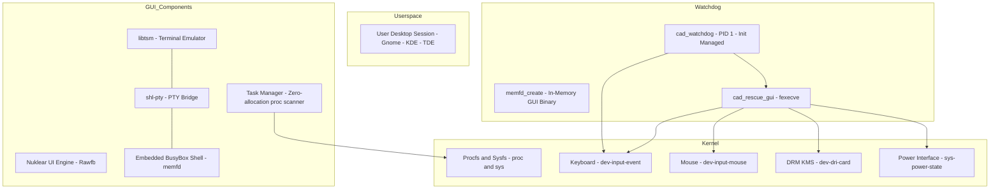

### 2. Boot & Switch Sequence (Ctrl+Alt+Del Trigger)
Depicts the execution sequence when the user triggers the rescue hotkey, taking mastership of inputs and display.

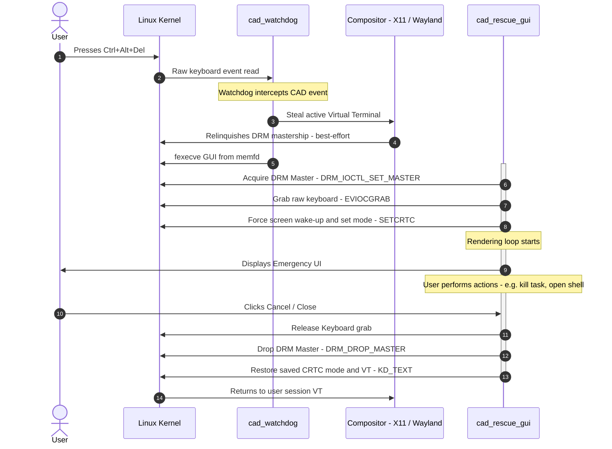

### 3. DRM Rendering & Buffer Fallback Tree
Details the render pipeline's decision tree when double-buffering page flips fail, falling back dynamically to a single-buffer layout with dirty frame flushes.

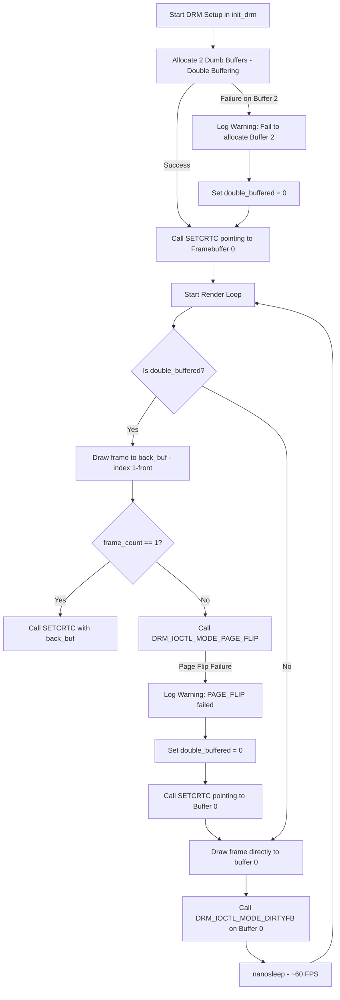

## Technical Development & Compilation

The project relies on:
- `Nuklear` for window rendering (modified `nuklear_rawfb.h` to use our custom DRM buffer, with dual-font support: proportional for UI, monospace for terminal).
- `libtsm` (statically linked) for terminal emulation: VTE state machine, screen buffer, and Unicode handling.
- `shl-pty` (statically linked) for pseudo-terminal management: fork, I/O bridge, and signal propagation to the shell child.
- **Optimized Binary Compression & Packaging**:
  * **Development Mode**: Compressed using **LZ4-HC** (`make COMPRESS=lz4`) for near-instant compilation speed.
  * **Release Mode**: Compressed using **ZX0** (`make COMPRESS=zx0`) for maximum compression ratio, saving additional RAM/disk space.
  * **Host-Native Vectorization**: The `bin_packer` utility is compiled using aggressive native CPU optimization flags (`-O3 -march=native -mtune=native -flto -funroll-loops`) to accelerate the CPU-intensive optimal path calculations of the ZX0 compression engine.
  * Compression and decompression routines are adapted from the [zelf](https://github.com/seb3773/zelf) executable packer project.
- Zero external file dependencies: icons (shutdown, terminal, find) and fonts are converted into C headers containing raw byte arrays.

### Compilation

By default, the project is compiled **statically against `musl libc`** using `musl-gcc`. This offers two massive advantages for a system rescue tool:
1. **Ultra-lightweight binaries**: The RAM footprint is reduced by **52%** (e.g. `cad_watchdog` goes from 678 KB down to **63 KB**).
2. **True standalone independence**: Unlike glibc, which silently tries to dynamically load NSS libraries (like `libnss_files.so`) at runtime for user/password resolution, musl resolver and passwd parsing are 100% statically integrated.

#### Build Commands

To build using the default **musl** static compiler:
```bash
make
```

To build using **glibc** static compilation as a fallback (requires `glibc-static` package):
```bash
make STATIC_LIBC=glibc
```

To build with console debug outputs enabled (for troubleshooting):
```bash
make DEBUG=1
```
*Note: By default (`DEBUG=0`), absolutely all console outputs (stdout/stderr) are compiled out for production, ensuring the GUI binary remains completely silent.*

To clean build artifacts:
```bash
make clean
```

### Compilation Themes & Automation Script

To make the rescue GUI highly customizable without introducing runtime configuration file dependencies (keeping it 100% standalone, freestanding, and memory-safe), the theming system is fully compiled-in.

#### 1. Theme Folder Structure
Each theme is stored in a subfolder under `assets/` (e.g., `assets/base/`, `assets/color/`, `assets/tech/`) and contains:
- `cad_theme.conf` : Configuration file defining UI dimensions (windows size, layouts) and colors (XRGB format).
- `font.ttf` : TrueType font file embedded into the C header (`custom_font.h`).
- `pointer` : Xcursor pointer file defining the custom ARGB hardware-level mouse cursor.
- `.png` files : Custom assets for the 14 UI system icons.

#### 2. The Build Wrapper (`build.sh`)
An automation wrapper script, `build.sh`, coordinates the generation of assets and final compilation:
```bash
./build.sh [theme_name] [compress_mode]
```

**Parameters:**
- `theme_name` : The name of the theme directory inside `assets/` (e.g., `base`, `color`, `tech`). Default is `base`.
- `compress_mode` : The compression algorithm for the embedded GUI payload: `lz4` (near-instant compilation, good for dev) or `zx0` (maximum optimal compression, recommended for production). Default is `lz4`.

**What the script does under the hood:**
1. Copies the selected theme files into the temporary compilation assets folder `assets_build/`.
2. Compiles and executes the native host utility `theme_generator` to parse the theme config file and produce `cad_theme.h`.
3. Runs `convert_pngs.py` to compile the TTF font, Xcursor file, and PNG icons into inline C byte arrays (e.g., `custom_font.h`, `cursor_data.h`, and `*_icon.h`).
4. Performs a `make clean` and invokes `make` with the chosen `COMPRESS` mode to build the final `lnxcad` executable.


## Installation & Deployment

lnxCAD runs as a root watchdog process started automatically at system boot. The project provides two automation scripts to handle setup and startup service registration.

### 1. Standalone Installer (`install.sh`)

The standalone installer detects your system init daemon and configures lnxCAD to start automatically at boot with high priority.

#### Installation
Run the script as root:
```bash
sudo ./install.sh install
```
*Note: The script searches for a compiled `lnxcad` binary in the current directory or uses the precompiled ones under `precompiled_binairies/base/`.*

#### Uninstallation
To completely remove the service and the binary:
```bash
sudo ./install.sh uninstall
```

#### Supported Init Systems:
- **systemd** : Installs `/etc/systemd/system/lnxcad.service` with automatic respawn (`Restart=always`), real-time scheduling priority (`Nice=-20`), and OOM killer immunity.
- **SysVinit / OpenRC (inittab)** : Registers `lnxcad` using `respawn` inside `/etc/inittab` if available, enabling robust PID 1 native daemon supervision.
- **SysVinit / OpenRC (init.d)** : Fallback helper script installed in `/etc/init.d/lnxcad` and registered via `update-rc.d`, `chkconfig`, or `rc-update`.
- **runit** : Configures a runit service directory `/etc/sv/lnxcad` and registers it in your active service folder (e.g. `/var/service`).
- **rc.local** : Universal fallback starting the daemon in the background from `/etc/rc.local`.

---

### 2. Debian Packaging (`build_deb.sh`)

If you want to deploy lnxCAD on multiple Debian/Ubuntu servers, you can build a native `.deb` package containing the precompiled binary and post-installation hooks.

#### Building the Package
```bash
./build_deb.sh
```
This builds a package named `lnxcad_1.0_amd64.deb` which contains the compiled `lnxcad` watchdog binary and configures the startup hook scripts under `DEBIAN/`.

#### Deploying the Package
```bash
sudo dpkg -i lnxcad_1.0_amd64.deb
```
The package has **no dependencies** (since `lnxcad` is built statically), and automatically invokes the init detection logic during its `postinst` stage to configure and start the daemon.

#### Removing the Package
To stop the service and remove the binary:
```bash
sudo dpkg -r lnxcad
```
To purge service configs and unit files:
```bash
sudo dpkg -P lnxcad
```


## Disaster & Hardware Failure Resilience (Zero-Trust Analysis)

**CAD Rescue GUI** is engineered as a "zero-trust" utility, specifically designed to remain operational and responsive when the underlying system is experiencing severe hardware failures (such as a dying disk, read-only filesystem lock, or missing system binaries).

### 1. Zero Runtime Shared Library Dependencies
Because the binary is strictly **statically linked** (compiled via `musl-gcc` or static `glibc`), it has **zero runtime dependencies** on dynamic shared libraries (`.so` files). 
- If the system’s dynamic linker (`ld-linux.so`) or libraries in `/lib` / `/usr/lib` are corrupt, deleted, or unreadable, the rescue utility will still load and execute perfectly.

### 2. File Access Profiling
The utility only interacts with two types of files at runtime:
- **In-Memory Virtual Filesystems (No Physical I/O)**: `/proc` (for process stats), `/sys` (for power states & backlights), and `/dev` (for DRM/KMS graphics and raw input events). These reside entirely in RAM and continue to function seamlessly even if the physical drive is disconnected.
- **Physical Disk Files (Best-Effort Fallbacks)**: `/etc/passwd` (session detection), `/etc/shadow` (fallback authentication), and external utilities (`reboot`, `systemctl`, `su`, `sudo`, `passwd`, and screen lockers).

### 3. Crisis Scenarios & Failure Recovery Modes

| Disaster Scenario | System Impact | CAD Rescue GUI Recovery Action |
| --- | --- | --- |
| **Disk transitions to Read-Only (`RO`)** | Filesystems lock up, databases crash, and writing to the hard drive throws errors. | **100% Operational.** Since writing is only done to virtual memory filesystems (`/proc` and `/sys`), the tool functions normally. If debug logging (`ENABLE_DEBUG`) is active, write errors to `auth_debug.log` are gracefully ignored. Password changes will fail gracefully due to read-only limitations, but the GUI will not hang or crash. |
| **Complete Disk I/O Failure / Drive Death** | Physical files become unreadable or disappear. Standard binaries like `/bin/sh` or `/sbin/reboot` are inaccessible. | **Self-Contained RAM Survival.** <br>• **RAM-Backed Shell**: If `/bin/bash` or `/bin/sh` cannot be loaded, switching the terminal to *Busybox mode* runs an embedded, pre-loaded Busybox executable directly from a RAM-backed `memfd` file descriptor, bypassing physical storage completely.<br>• **Authentication Resiliency**: If disk-bound `su` or `sudo` binaries are corrupt, PTY authentication fails gracefully and falls back to a clean message in the UI rather than crashing.<br>• **Hardware-Level Power Off**: If `reboot` or `systemctl` binaries are missing from the disk, the power action falls back to a direct kernel reboot system call (`sys_reboot`), which commands the motherboard to restart directly from the CPU/RAM cache without reading a single byte from the disk. |
| **Catastrophic Desktop Environment Crash** | Graphical servers freeze, graphics drivers hang, or the screen blanks out. | **Physical Screen Takeover.** The DRM/KMS driver takes direct control of `/dev/dri/card*` and `/dev/input/event*` (which are RAM-backed), bypassing the window manager entirely. In the event of a GPU wakeup issue, the mode setting is automatically retried after a short delay. If the rescue utility itself suffers a memory corruption crash, the `emergency_restore` signal handler utilizes direct kernel system calls to restore the original Virtual Terminal and reactivate the physical SysRq hardware keys. |


## Notes & Integration

### Wayland & systemd-logind Compatibility

Modern desktop environments using Wayland and `systemd-logind` (such as GNOME or KDE Plasma) enforce strict access control over inputs and display resources, which can introduce specific edge-case behaviors:

1. **DRM Master Refusal**: In a Wayland session, the active compositor (Mutter, KWin) acquires DRM mastership under logind supervision. If `lnxCAD` attempts to call `ioctl(DRM_IOCTL_SET_MASTER)`, the kernel may deny the request or the compositor may automatically reclaim mastership, preventing standard double-buffered page flips.
2. **VT Switching Blocks**: Modern compositors sometimes hook VT switch events (`VT_ACTIVATE`) or logind may restrict switches initiated outside a registered seat session.
3. **Double-Buffering Glitches**: On certain Intel/AMD graphics chipsets running under strict display server setups, forced hardware modesetting can result in screen flickering or double-buffering page-flip errors.

#### Architectural Mitigations & Fallbacks:
To guarantee that the emergency interface displays under these conditions, `lnxCAD` implements the following mechanisms:
- **Dynamic Single-Buffer Fallback**: If `DRM_IOCTL_MODE_PAGE_FLIP` fails during rendering (due to driver restrictions or mastership contention), the GUI immediately falls back to **Single-Buffer Mode**. It stops calling page flips, points the CRTC to Dumb Buffer 0, and switches to direct buffer drawing.
- **Dirty Frame Notifications (`DIRTYFB`)**: In single-buffer mode, `lnxCAD` invokes `DRM_IOCTL_MODE_DIRTYFB` on every frame. This notifies the DRM driver (and virtualized rendering engines like QXL or VirtIO-GPU) to flush the modified screen regions, bypassing the need for a cooperative compositor or page flips.
- **Console modesetting and muting**: During the takeover, the Virtual Terminal is forced into `KD_GRAPHICS` to prevent text output corruption, and kernel printk logs are muted.

### Terminal Escape Sequences under X11 (e.g. `^[[3;7~`)
When invoking the rescue GUI using the Ctrl+Alt+Delete combination under X11, you might notice terminal escape sequences like `^[^[[3;7~` printed in the active console or text editor. This occurs because the watchdog daemon `lnxcad` runs as a low-level background process reading raw `/dev/input/event*` devices without grabbing the keyboard permanently (which would block input for your entire session). Consequently, the active window still receives the Ctrl+Alt+Delete key events and translates them into escape sequences.

To completely prevent this behavior, you can either:
1. Register **Ctrl+Alt+Delete** as a global shortcut in your desktop environment (like TDE/KDE) to execute a dummy command (like `/bin/true`).
2. Use a specialized X11 utility like [qsuperl](https://github.com/seb3773/qsuperl) which connects to X11 and calls `XGrabKey` to grab the key combination globally.

Since the desktop environment or `qsuperl` grabs the key combination, X11 will "eat" it (preventing any characters from being sent to your active window), while the low-level watchdog `lnxcad` will still receive the hardware event from the raw `/dev/input/event*` node and successfully launch the rescue GUI.


## Screenshots & Gallery

Here is a visual overview of the different emergency screens and diagnostic utilities built into **lnxCAD**:

| **Main Menu & Options** | **Power Options Menu** |
| :---: | :---: |
| 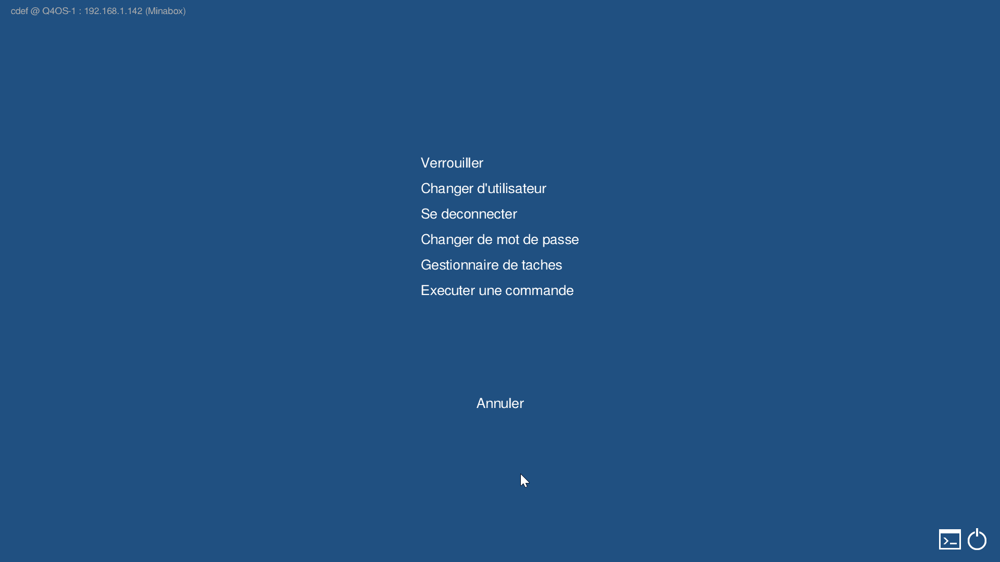 <br> *The main Ctrl+Alt+Del intervention screen.* | 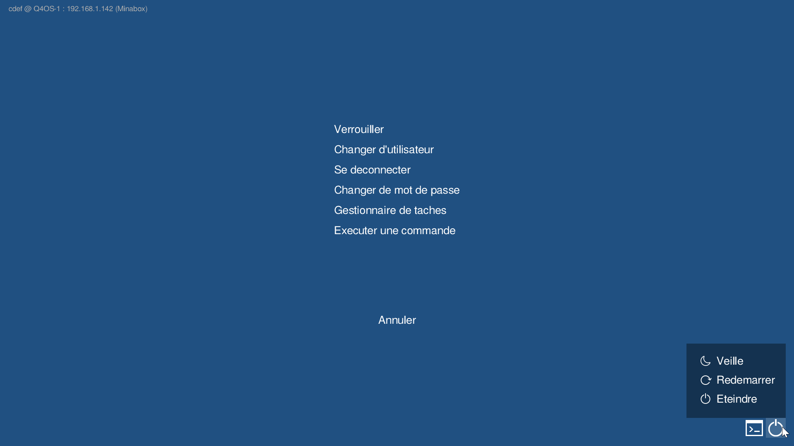 <br> *Reboot, Shutdown, or Sleep options.* |

| **Root Authentication** | **Run Command Box** |
| :---: | :---: |
| 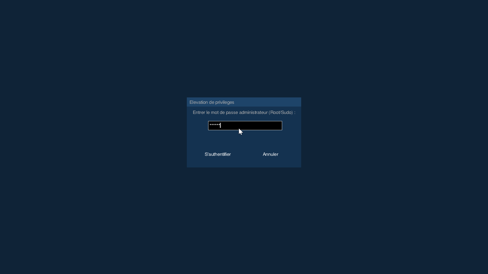 <br> *Secure administrator privilege elevation.* | 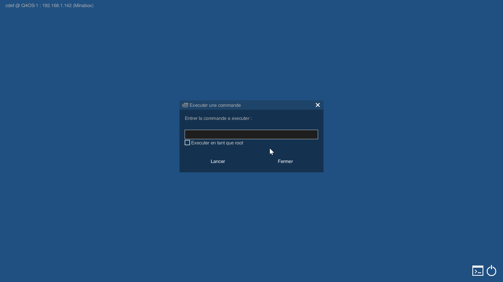 <br> *Execution box with root-privilege checkbox.* |

| **Change Password** | **Switch Session Menu** |
| :---: | :---: |
| 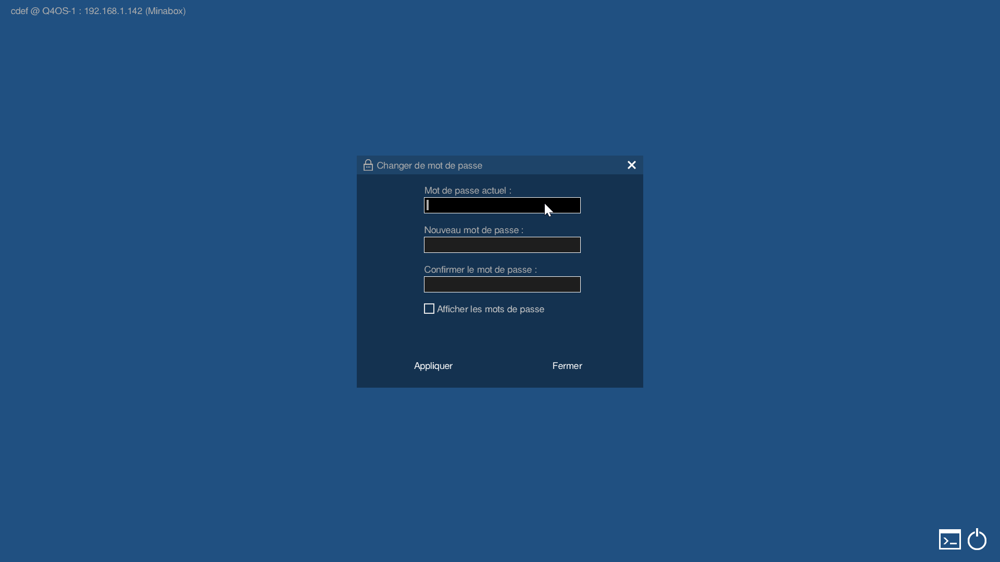 <br> *Emergency user password modification.* | 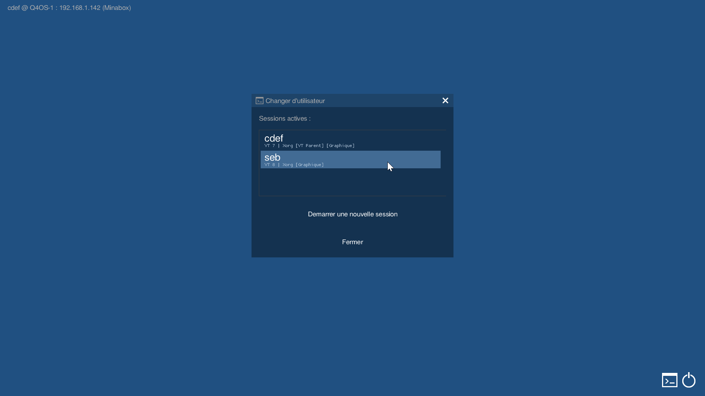 <br> *Interactive multi-user VT display list.* |

| **Task Manager (CPU Load)** | **Task Manager (Search)** |
| :---: | :---: |
| 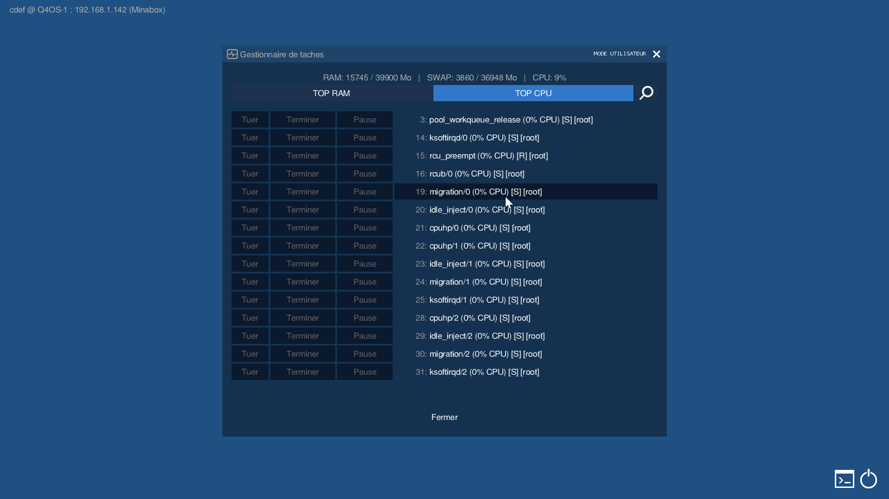 <br> *Real-time process stats with Kill actions.* | 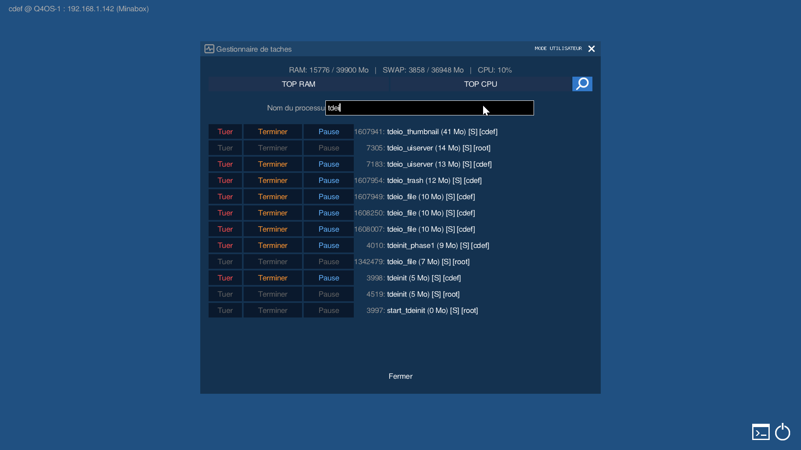 <br> *Filter processes dynamically by name.* |

| **RAM-Backed BusyBox Shell** |
| :---: |
| 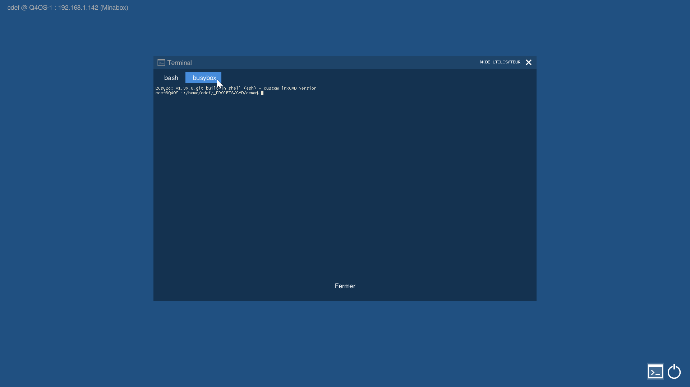 <br> *Embedded static shell pinned in virtual memory.* |


